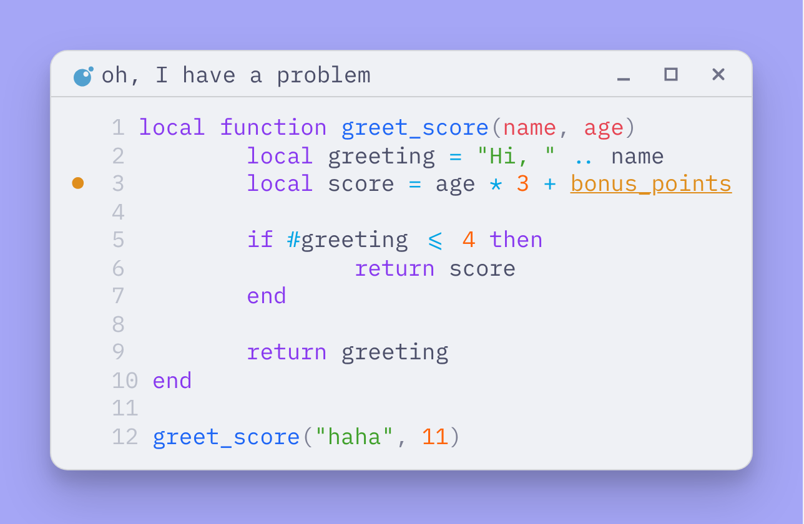

# <div align="center"> imprint.nvim </div>

<div align="center">

**WYSIWYG code screenshots from Neovim (TOhtml -> PNG)**  

</div>

Create images from the current buffer or a visual selection - with the same colorscheme, highlights, and diagnostics you see in Neovim.

*   Buffer **or** selected range
*   Preserves Neovim highlights and colors
*   Optional titlebar icon (via `nvim-web-devicons`)
*   Save to file and/or copy to clipboard



## Install

### lazy.nvim

```lua
{
    "glyccogen/imprint.nvim",
    cmd = "Imprint",
    dependencies = {
        "nvim-tree/nvim-web-devicons", -- optional, for file icons in the titlebar
    },
    config = function()
        require("imprint").setup({})
    end,
}
````

### packer.nvim

```lua
use {
    "glyccogen/imprint.nvim",
    cmd = "Imprint",
    requires = {
        "nvim-tree/nvim-web-devicons", -- optional, for file icons in the titlebar
    },
    config = function()
        require("imprint").setup({})
    end
}
```

## Dependencies

-   **Neovim 0.10+**
-   **Python 3.8+** with `pip` and `venv`
-   (optional) `nvim-web-devicons` for file icons in the titlebar
-   (optional) one clipboard backend:
    - `xclip` (X11)
    - `wl-copy` (Wayland)
    - `osascript` (macOS)

### how it works

1.  **html export** - plugin calls Neovim’s built‑in `:TOhtml` command (Lua `tohtml` module, Neovim 0.10+), which converts the current buffer or visual selection into a temporary html file.
2.  **headless capture** - `py/render.py` renders html file using **Playwright**. It launches a headless Chromium browser, takes a screenshot of the rendered code block.
3.  **window dressing** - then same Python script adds a window frame and background.
4.  **result delivery** - the resulting image is saved to the output directory if `--clipboard-only` is not set. If `copy_to_clipboard` is enabled, the image is copied to the system clipboard.

> [!WARNING]
> the Python/Playwright step is isolated in a dedicated virtual environment, so it does not interfere with your system Python packages, and Playwright with Chromium is downloaded only once on first use.

## Configuration and default values

```lua
require('imprint').setup({
	-- default title used for the window header
	-- fallback if no title is provided
	default_title = nil,

	-- when true, prompt for a title if none was provided and --notitle is not set
	required_title_by_default = true,

	-- copy the generated image to the clipboard after saving
	copy_to_clipboard = false,

	-- output directory for saved screenshots
	-- when nil, saves to the current file's directory
	output_dir = nil,

	-- hex-code for the background outside the code window
	background = "#A5A6F6",

	-- line number visibility
	-- true:              current settings
	-- false:             no line numbers
	-- "absolute":        absolute line numbers
	-- "absolute_from_1": absolute line numbers starting from 1 in the image
	line_numbers = "absolute_from_1",

	-- highlight the line number the cursor is on
	highlight_current_line = false,

	-- show diagnostic signs highlights
	diagnostics_on = false,

	-- show a file icon in the titlebar
	-- depends on nvim-web-devicons
	icons_on = true,
})
```

## Command **Imprint**

create a screenshot from the current buffer or a selected range.

```vim
:['<,'>]Imprint [-c | --clipboard-only] [--notitle] [title]
```

-   `-c`, `--clipboard-only` - copy the image to the clipboard and do not save it to disk
-   `--notitle` - do not prompt for a title when none is provided
-   `title` - optional title for the window header

## Troubleshooting

**Playwright install fails on first run**

`imprint.nvim` installs Chromium for Playwright. If step fails, system may be missing OS packages Playwright needs. In that case, run:

```bash
/path/to/imprint/venv/bin/playwright install --with-deps chromium
```
